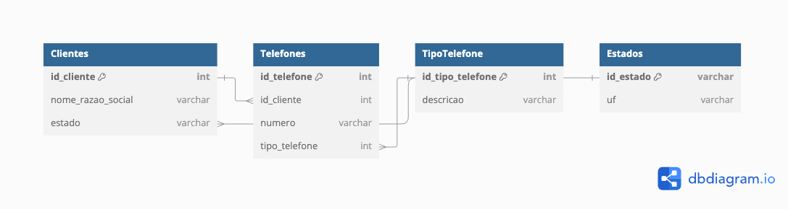

# Respostas da Gupy

# Pergunta 1:

```dart
void main() {
  int INDICE = 12, SOMA = 0, K = 1;

  while (K < INDICE) {
    K = K + 1;
    SOMA = SOMA + K;
  }

  print(SOMA); // Resposta: 77
}
```

Durante a execução desse trecho, a variável SOMA será incrementada continuamente enquanto K 
for menor que o valor de INDICE, que é 12. Ao final, SOMA terá o valor de 77, pois é a soma 
dos números de 2 até 11. Basicamente, estamos somando 2 + 3 + 4 ... + 12.

# Pergunta 2:

a) 9
A sequência segue números ímpares: 1, 3, 5, 7... O próximo número ímpar é 9.

b) 128
Essa sequência é de potências de 2: 2, 4, 8, 16, 32, 64... O próximo número é 128 (2^7).

c) 49
Essa sequência segue os quadrados dos números inteiros: 0², 1², 2², 3²... O próximo número será 7² = 49.

d) 100
Aqui, a lógica também segue quadrados de números pares: 2², 4², 6²... O próximo número é 10² = 100.

e) 13
Essa é a sequência de Fibonacci: cada número é a soma dos dois anteriores. O próximo será 5 + 8 = 13.

f) 20
Aqui, a sequência exclui números com o dígito '1' depois do 10. Segue 17, 18, 19... O próximo é 20.

# Pergunta 3:

```dart
import 'dart:math';

void main() {
  // Preparando os dados iniciais
  List<double> faturamento =
      geradorDeFaturamentoRandomicoComBaseEmTodosOsDiasUteisDe2024();

  double menor = double.infinity;
  double maior = double.negativeInfinity;
  double soma = 0;
  int diasComFaturamento = 0;

  for (var valor in faturamento) {
    if (valor < menor) menor = valor;
    if (valor > maior) maior = valor;
    soma += valor;
    diasComFaturamento++;
  }

  double media = soma / diasComFaturamento;
  int diasAcimaDaMedia = 0;

  for (var valor in faturamento) {
    if (valor > media) {
      diasAcimaDaMedia++;
    }
  }

  print("O menor valor de faturamento ocorrido em um dia do ano: $menor");
  print("O maior valor de faturamento ocorrido em um dia do ano: $maior");
  print(
      "Número de dias no ano em que o valor de faturamento diário foi superior à média anual: $diasAcimaDaMedia");
}

bool _isFeriado(DateTime date) {
  // Simulando lista de feriados nacionais do Brasil em 2024
  List<DateTime> feriados = [
    DateTime(2024, 1, 1), // Confraternização Universal
    DateTime(2024, 2, 12), // Carnaval
    DateTime(2024, 2, 13), // Carnaval
    DateTime(2024, 3, 29), // Sexta-feira Santa
    DateTime(2024, 4, 21), // Tiradentes
    DateTime(2024, 5, 1), // Dia do Trabalho
    DateTime(2024, 6, 20), // Corpus Christi
    DateTime(2024, 9, 7), // Independência do Brasil
    DateTime(2024, 10, 12), // Nossa Senhora Aparecida
    DateTime(2024, 11, 2), // Finados
    DateTime(2024, 11, 15), // Proclamação da República
    DateTime(2024, 12, 25), // Natal
  ];

  return feriados.contains(date);
}

bool _isDiaUtil(DateTime date) {
  // Verificar se o dia é útil (não é final de semana e não é feriado)
  return date.weekday != DateTime.saturday &&
      date.weekday != DateTime.sunday &&
      !_isFeriado(date);
}

List<double> geradorDeFaturamentoRandomicoComBaseEmTodosOsDiasUteisDe2024() {
  final double mediaInicial = 10000;
  List<double> faturamentoDiario = [];
  Random random = Random();

  // Percorrer todos os dias de 2024
  for (int mes = 1; mes <= 12; mes++) {
    for (int dia = 1; dia <= DateTime(2024, mes + 1, 0).day; dia++) {
      DateTime date = DateTime(2024, mes, dia);

      // Verificar se o dia é útil
      if (_isDiaUtil(date)) {
        // Gerar faturamento randômico com variação de +-30%
        double variacao = (random.nextDouble() * 0.6) - 0.3;
        double faturamento = mediaInicial * (1 + variacao);

        faturamentoDiario.add(faturamento);
      }
    }
  }

  return faturamentoDiario;
}
```

# Pergunta 4:

Para essa aplicação de cadastro de clientes, a estrutura de banco de dados proposta seria a seguinte:

Clientes: armazena as informações dos clientes.
id_cliente (PK)
nome_razao_social
estado (referência à tabela de estados)

Telefones: guarda os números de telefone de cada cliente.
id_telefone (PK)
id_cliente (FK, referencia a tabela de Clientes)
numero
tipo_telefone (FK, referencia a tabela de TipoTelefone)

TipoTelefone: armazena os tipos de telefone.
id_tipo_telefone (PK)
descricao

Estados: armazena os estados brasileiros.
id_estado (PK)
uf (abreviação do estado, como "SP", "RJ", etc.)

Utilizando o app https://dbdiagram.io/

Necessitaremos colar o seguinte diagrama:
```shell
Table Clientes {
  id_cliente int [pk]
  nome_razao_social varchar
  estado varchar
}

Table Telefones {
  id_telefone int [pk]
  id_cliente int [ref: > Clientes.id_cliente]
  numero varchar
  tipo_telefone int [ref: > TipoTelefone.id_tipo_telefone]
}

Table TipoTelefone {
  id_tipo_telefone int [pk]
  descricao varchar
}

Table Estados {
  id_estado varchar [pk]
  uf varchar
}

Ref: Clientes.estado > Estados.id_estado
```

## Imagem gerada pelo https://dbdiagram.io/:


Relacionamentos:
Um cliente pode ter muitos telefones (1
).
Um telefone tem um tipo específico (N:1).
Um cliente pertence a um estado (N:1).
Aqui está um exemplo de SQL para buscar os clientes de São Paulo com seus telefones:
```dart
SELECT c.id_cliente, c.nome_razao_social, t.numero 
FROM Clientes c
JOIN Telefones t ON c.id_cliente = t.id_cliente
JOIN Estados e ON c.estado = e.id_estado
WHERE e.uf = 'SP';
```

# Pergunta 5:

No caso dos dois veículos, carro e caminhão, eles estão se movendo em direções opostas numa estrada de 125 km. O carro está viajando a 90 km/h e o caminhão a 80 km/h. Como o carro tem que parar nos pedágios (o que leva 15 minutos extras no total), mesmo sendo mais rápido, o caminhão estará mais próximo de Ribeirão Preto quando se cruzarem.

Isso acontece porque, apesar de o carro ter uma velocidade maior, o tempo perdido nos pedágios faz com que o caminhão, que não tem essa perda de tempo, cubra mais terreno em relação à cidade de origem dele.

Explicação:

O carro leva 1,39 horas (125 km / 90 km/h) para percorrer a distância sem considerar os pedágios, mas ao adicionar 15 minutos (0,25 horas), o tempo total é 1,64 horas.
O caminhão percorre os 125 km em 1,56 horas (125 km / 80 km/h), já que ele não perde tempo nos pedágios.
Portanto, quando eles se cruzarem, o caminhão estará mais próximo de Ribeirão Preto.